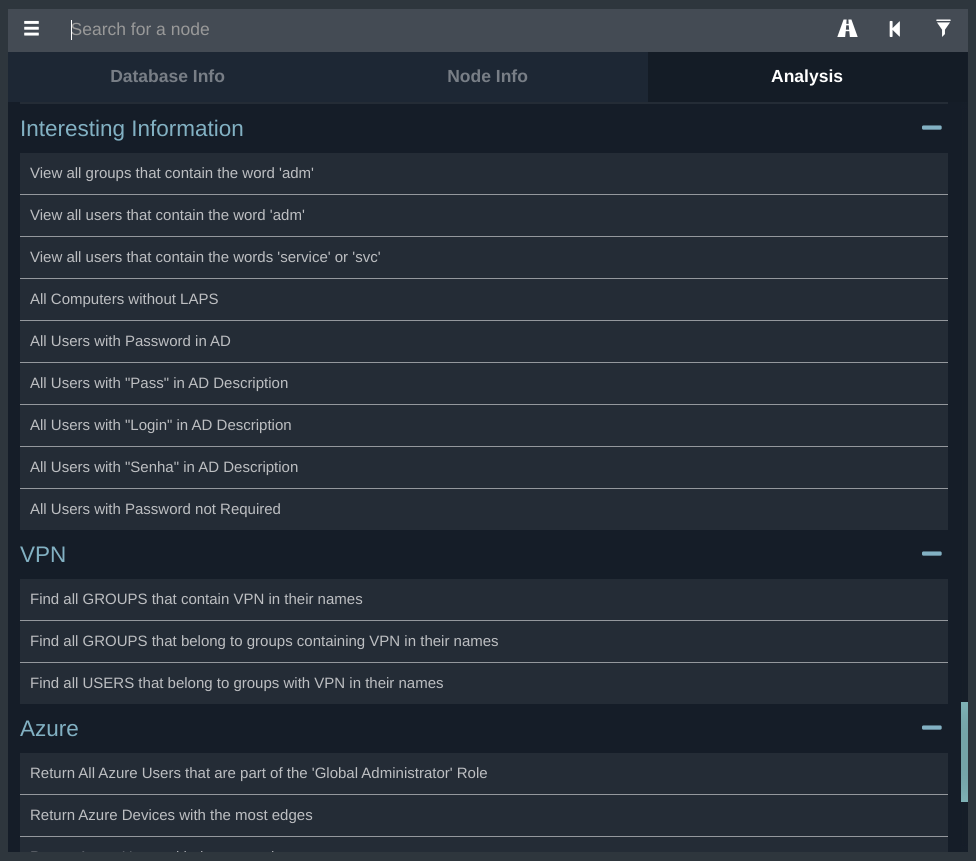

# BloodHound-Queries
Custom queries list for BloodHound


## Introduction
This is mostly a compilation of some awesome queries I've found out there, with a few additions according to my needs and also some bug fixes.

Currently, these queries are based on:
  - [hausec's custom queries](https://github.com/hausec/Bloodhound-Custom-Queries)
  - [CompassSecurity's custom queries](https://github.com/CompassSecurity/BloodHoundQueries)


The queries are grouped by categories, as shown in the example below:



## Get Started
On Linux, you can simply install the queries using this curl command:
```sh
$ curl -o "~/.config/bloodhound/customqueries.json" "https://raw.githubusercontent.com/yok4i/BloodHound-Queries/main/customqueries.json"
```

On Windows, you can simply install the queries using this PowerShell command:
```powershell
PS C:\> Invoke-WebRequest -Uri "https://raw.githubusercontent.com/yok4i/BloodHound-Queries/main/customqueries.json" -OutFile "$env:USERPROFILE\AppData\Roaming\bloodhound\customqueries.json"
```

## Extras
Besides the previously cited repos, you may also find useful content about BloodHount at [awesome-bloodhound by chryzsh](https://github.com/chryzsh/awesome-bloodhound).
There is also a great cheatsheet at https://neo4j.com/docs/cypher-refcard.
For more information, see the [official documentation](https://neo4j.com/docs/cypher-manual/current).

## Resources
  - [Azure relationships list](https://raw.githubusercontent.com/BloodHoundAD/AzureHound/main/enums/relationship.go)

### Helper scripts

List all relationships used by AzureHound in Cypher Query format:
```sh
curl -s https://raw.githubusercontent.com/BloodHoundAD/AzureHound/main/enums/relationship.go | egrep -o "Relationship\s*=\s*\"[^\"]+\"" | cut -d\" -f2 | tr '\n' '|' | sed -E -e 's/^/:/' -e 's/\|$//'
```
